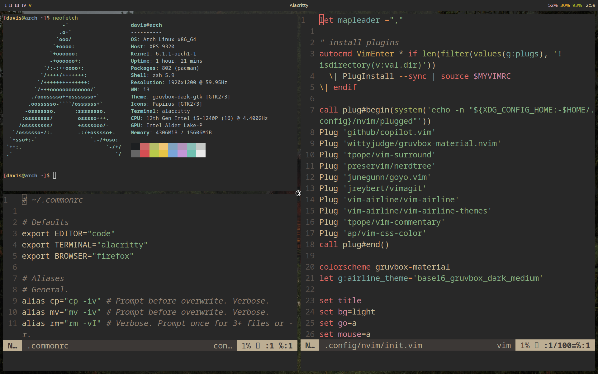

# My Dotfiles

This repository contains my personal configuration files, also known as dotfiles. These files configure various programs that I use daily on my computer which runs Arch Linux with the i3 window manager.

Below is a sample of what my desktop looks like. For a more detailed description of the programs and configuration files included in this repository, please see the table of contents.

## Table of Contents

* [Foreword](#foreword)
* [Theme](#theme)
* [Programs](#programs)
  * [ZSH: a shell](#zsh-a-shell)
  * [i3: a tiling window manager](#i3-a-tiling-window-manager)
  * [Polybar: a status bar for the desktop environment](#polybar-a-status-bar-for-the-desktop-environment)
  * [Rofi: a program launcher](#rofi-a-program-launcher)
  * [Alacritty: a terminal emulator](#alacritty-a-terminal-emulator)
  * [Neovim: a text editor](#neovim-a-text-editor)
  * [Dunst: a notification daemon](#dunst-a-notification-daemon)
  * [MPV: a media player](#mpv-a-media-player)
  * [MPD and ncmpcpp: a music player daemon and client](#mpd-and-ncmpcpp-a-music-player-daemon-and-client)
  * [Neofetch: a system information tool](#neofetch-a-system-information-tool)
  * [Newsboat: a RSS feed reader](#newsboat-a-rss-feed-reader)
  * [Sxiv: an image viewer](#sxiv-an-image-viewer)
  * [Picom: a compositor for transparent windows](#picom-a-compositor-for-transparent-windows)
* [I have made some minor modifications to the following files:](#i-have-made-some-minor-modifications-to-the-following-files)
  * [.xinitrc](#xinitrc)
  * [.Xresources: used to configure the appearance of programs that use the X Resource Manager](#xresources-used-to-configure-the-appearance-of-programs-that-use-the-x-resource-manager)

## Foreword

Blindly copying and pasting someone else's dotfiles can be dangerous because it can overwrite your existing configuration files and potentially cause problems with your system. It is important to read and understand the configuration files before using them, and to modify them to suit your personal preferences and needs.

## Theme

I use the gruvbox color scheme for my terminal and other programs.

## Programs

### ZSH: a shell

I prefer to use zsh as my shell since it's more feature rich and modern, but my configuration files also work with bash. The configuration included in this repository has been modified to include a variety of useful features, including:

#### ZSH specific features
* Syntax highlighting
* Better tab completion
* Vi mode

#### POSIX shell features
* Useful aliases and functions
* Auto ls after cd
* Informative prompt
* Caps lock and escape key swap
* Home, end, and delete keys work properly

Most shell configuration is in the `.commonrc` file so that it can be shared between bash and zsh. The `.zshrc` and `.bashrc` files are used to set features specific to each shell.

### i3: a tiling window manager

i3 is the most popular tiling window manger because it is lightweight, easy to use, and highly customizable. The configuration included in this repository has been modified to include a variety of useful features, including:

* Gruvbox theme
* Random wallpaper script
* Gaps between windows (not available if using i3 non-gaps package which will be phased out in the future)
* i3lock support
* screenshot support (using maim)
* normal vim keys (`hjkl`, not i3's default shifted vim keys `jkl;`)

This config is highly personalized and is not a plug-and-play solution. I recommend users to familiarize themselves with the changes made and the keybindings used in order to fully take advantage of this configuration.

### Polybar: a status bar for the desktop environment

Polybar is a lightweight and highly customizable bar that can be displayed at the top of the screen. I prefer it to i3's built in status bar. My configuration includes active workspaces displayed on the left, the active window's title displayed in the middle, and various system information such as volume, brightness, battery, and time displayed on the right. Some modules are able to be clicked for added functionality but no features require mouse use. This configuration allows for quick and easy access to important information and nothing more.

### Rofi: a program launcher

Rofi is a powerful and customizable application launcher and window switcher. I prefer it to dmenu The configuration included in this repository has been modified only with cosmetic settings to make it blend seamlessly with the Gruvbox theme. No functional changes have been made to Rofi.

### Alacritty: a terminal emulator

Alacritty is  a fast and lightweight terminal emulator. The configuration included in this repository has been modified to match the Gruvbox theme, with the background color changed to blend seamlessly with the overall visual style. In addition, the dynamic window title feature has been enabled, allowing the terminal window to display the current working directory or command being run. If you are looking for a more feature rich but similar terminal consider Kitty instead.

### Neovim: a text editor

Neovim is a fork of the popular Vim text editor. This configuration includes the official Gruvbox theme, which was originally designed for Vim. In addition, the configuration uses Plug, a plugin manager, to manage and install a variety of useful plugins, including vim-surround, nerdtree, goyo, vim-airline, and vim-css-color. Please note that this configuration includes significant modifications and is not a plug-and-play solution. I recommend users to familiarize themselves with the changes made and the plugins installed in order to fully take advantage of this configuration.

### Dunst: a notification daemon

Dunst is a lightweight and customizable notification daemon. The configuration included in this repository has been modified to fit the Gruvbox theme. No functional changes have been made to Dunst.

### MPV: a media player

MPV is a powerful and lightweight media player. This configuration makes MPV start in windowed mode rather than fullscreen, display images indefinitely, and automatically selects English audio tracks and subtitles when available. Most importantly, it includes mpris support meaning media keys will work with MPV as well as a script that allows the deletion of the currently playing file.

### MPD and ncmpcpp: a music player daemon and client

MPD is to music what MPV is to video. It is a powerful and lightweight music player daemon. MPD shouldn't be used directly, but rather with a client such as ncmpcpp. The MPD configuration is very simple and only includes the location of songs and playlists along with audio visualization support. The ncmpcpp configuration is more complex but mostly boils down to Vim keybindings and minor cosmetic changes.

### Neofetch: a system information tool

Neofetch is a command-line system information tool. The configuration included in this repository has been modified to include the display of the screen's refresh rate alongside the resolution in the output.

### Newsboat: a RSS feed reader

Newsboat is a powerful and lightweight RSS feed reader. The configuration included in this repository has undergone a plethora of modifications to enhance its functionality and convenience for the user. Some of the notable changes include the ability to notify the user of new RSS feed items, the option to open the feed in the default browser, the ability to open videos with MPV, the use of Vim keys to navigate, and various changes to the color scheme.

### Sxiv: an image viewer

Sxiv is a simple and lightweight image viewer. The configuration included in this repository has been modified to include a convenient shortcut for deleting the currently displayed image. By pressing Ctrl+X followed by Ctrl+D, users can delete the currently displayed image.

### Picom: a compositor for transparent windows

Picom is a lightweight compositor for X11 windowing systems. The configuration included in this repository is completely blank, as it has been created not to use any of its visual features, but instead to reduce screen tearing. Please note that Picom is an optional tool and is only necessary for users who experience screen tearing on their system. If you do not experience screen tearing, you may not need to use Picom at all.

## I have made some minor modifications to the following files:

### .xinitrc

Xinit is a utility that allows users to start an X Window System server and run window managers or desktop environments. The configuration included in this repository runs the i3 window manager when the startx command is run, allowing users to start an X server and launch i3 without the need for a login manager or display manager. This configuration offers a simple and lightweight solution for starting an X server and running a window manager, making it an ideal choice for users who prefer a minimalistic and efficient setup."

### .Xresources: used to configure the appearance of programs that use the X Resource Manager

Xresources is a database that stores default values for a variety of X Window System resources. The configuration included in this repository modifies the background colors of sxiv to match the Gruvbox theme.

## Wallpapers

I have also included a folder of wallpapers in the repository meant to go well with the Gruvbox theme and the i3 config random wallpaper script.

## Installation

To use these dotfiles on your own system, you can simply copy paste the text from the desire file and paste it into your own. However, I recommend you only take the parts from mine that interest you and modify the rest for your personal use.

## License

This project is licensed under the [GPL-3.0](LICENSE.md)
GNU General Public License - see the [LICENSE.md](LICENSE.md) file for
details.
