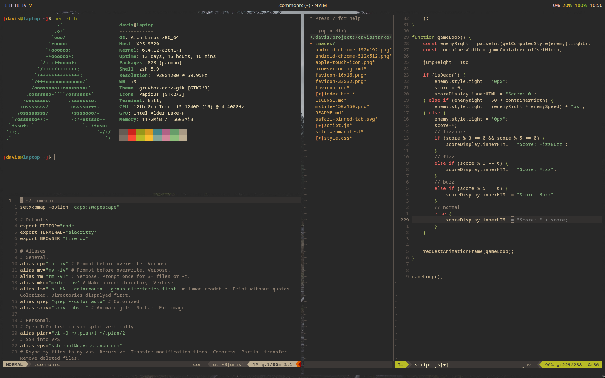

# My Dotfiles

This repository contains my personal configuration files, also known as dotfiles. These files configure various programs that I use daily on my computer which runs Arch Linux with the i3 window manager.

Below is a sample of what my desktop looks like. For a more detailed description of the programs and configuration files included in this repository, please see the table of contents.

## Table of Contents

* [Installation](#installation)
* [Theme](#theme)
* [Desktop Environment](#desktop-environment)
  * [i3](#i3)
    * [``.xinitrc``](#xinitrc)
    * [Picom](#picom)
  * [Polybar](#polybar)
  * [Rofi](#rofi)
  * [Dunst](#dunst)
  * [Neofetch](#neofetch)
* [Shell](#shell)
  * [zsh](#zsh)
  * [Alacritty](#alacritty)
* [neovim](#neovim)
  * [`init.lua`](#initlua)
  * [`options.lua`](#optionslua)
  * [`plugins.lua`](#pluginslua)
  * [`keymaps.lua`](#keymapslua)
  * [`colorscheme.lua`](#colorschemelua)
  * [`lsp.lua`](#lsplua)
  * [`config/nvim-cmp.lua`](#confignvim-cmplua)
* [Media](#media)
  * [mpv](#mpv)
  * [mpd](#mpd)
  * [ncmpcpp](#ncmpcpp)
  * [sxiv](#sxiv)
    * [``.Xresources``](#xresources---configures-x-window-system-resources)
* [Wallpapers](#wallpapers)
* [License](#license)

## Installation

**Warning**

*Blindly copying and pasting someone else's dotfiles can be dangerous. It is important to read and understand these configuration files before using them, and to modify them to suit your personal preferences and needs.*

To use these dotfiles on your own system, you can simply copy paste the text from the desired file and paste it into your own. However, I recommend you only take the parts from mine that interest you and modify the rest for your personal use.

## Theme

I use the Gruvbox color scheme for my desktop environment. Gruvbox is a retro groove color scheme for Vim, terminal emulators, and other text-based applications. It's colors are available at [morhetz/gruvbox](https://github.com/morhetz/gruvbox).

## Desktop Environment

### i3

i3 is the most popular tiling window manger because it is lightweight, easy to use, and highly customizable. The configuration included in this repository has been modified to include a variety of useful features, including:

* Gaps between windows (not available if using i3 non-gaps package which will be phased out in the future)
* Autotiling
* i3lock support
* normal vim keys (`hjkl`, not i3's default shifted vim keys `jkl;`)
* caps lock and escape key swap
* screenshot support (using maim)
* Random wallpaper script

**Breaking changes**

This program's config in particular is highly personalized and is not a plug-and-play solution. If an error occurs, it might make i3 unusable. I recommend users to familiarize themselves with the changes made and the keybindings used in order to fully take advantage of this configuration.

- JetbrainsMono Nerd Font is used. If you do not have this font installed, you will need to change the font in the config.
- Xrandr is set to 144hz. If you have a different refresh rate, you will need to change this.
- Autostart programs. A handfull of programs are started automatically when i3 starts. If you do not have these programs installed, you will need to remove them from the config.
- Hotkey programs. The programs I use most are bound to hotkeys. If you do not have these programs installed, these hotkeys will not work.

#### ``.xinitrc``

This file configures the command `startx` to open i3. This is nessecary since I do not use a login manager such as GDM or LightDM in the intrest of simplicity and speed.

#### Picom

Picom is a compositor for X11 windowing systems. The configuration included in this repository is completely blank, as it has been created not to use any of its visual features, but instead to reduce screen tearing. If you do not experience screen tearing, you do not need to use Picom.

### Polybar

Polybar is a lightweight and highly customizable bar that can be displayed at the top of the screen. I prefer it to i3's built in status bar because I find it easier to configure. My configuration includes the following modules in order from left to right:

- Workspace indicator
  - Active workspace is highlighted. Empty workspaces are not displayed. Clicking on a workspace or scrolling on the bar will switch workspaces.
- Playerctl module
  - Displays the currently playing song and artist. Clicking on the module will play/pause the song.
- Active Window title
  - Displays the title of the currently focused window.
- Volume
  - Displays the current volume level. Clicking on the module will mute/unmute the volume. Scrolling on the module will increase/decrease the volume.
- Brightness
  - Displays the current brightness level. Scrolling on the module will increase/decrease the brightness.
- Battery
  - Displays the current battery level. Clicking on the module will open the power manager. Scrolling on the module unfortunately cannot increase your battery level.
- Date and time
  - Displays the current time or date. Clicking on the module switches between the two.

### Rofi

Rofi is an application launcher. I prefer it to dmenu because it looks pretty.

### Dunst

Dunst displays notifications. That's it.

### Neofetch

Neofetch shows your system information. It isn't necessary, but it looks cool.

The configuration included in this repository has been modified to include the display of the screen's refresh rate alongside the resolution in the output.

## Shell

### zsh

I prefer to use zsh as my shell since it's more feature rich and modern, but my configuration files also work with bash. The configuration included in this repository has been modified to include a variety of useful features, including:

#### zsh specific features
* Syntax highlighting
* Better tab completion
* Vi mode

#### Shell agnostic features
* Useful aliases and functions (look in `.commonrc` to see them all)
* Auto ls after cd
* Informative prompt
* Home, end, and delete keys work properly

Most shell configuration is in the `.commonrc` file so that it can be shared between bash and zsh. The `.zshrc` and `.bashrc` files are used to set features specific to each shell.

### Alacritty

Terminals are very simple programs. I like Alacritty because it works. If you want more features, consider Kitty. If you want fewer features, consider st.

## neovim

neovim is just Vim but better. If you currently use Vim your current `init.vim` will work with neovim. There is no reason not to switch.
 
If you have never used Vim bindings before, you should look into them. They are the most efficient way to edit text. If you are interested in learning Vim simply using Vimtutor which is a interactive text tutorial that comes with Vim and neovim. If you would rather watch a video, I recommend you watch [The Primeagen's](https://www.youtube.com/@ThePrimeagen) playlist [Vim As Your Editor](https://www.youtube.com/watch?v=X6AR2RMB5tE&list=PLm323Lc7iSW_wuxqmKx_xxNtJC_hJbQ7R&pp=iAQB) on YouTube. This will teach you everything you need to know about Vim.

The configuration included in this repository has been modified to include a variety of useful features across multiple configuration files.

### `init.lua`
This file just imports the other configuration files.

### `options.lua`

This file configures the general options of neovim.

- Mouse support
- Use system clipboard
- 4 space tabs
- Convenient line wrapping
- Trailing white space removal on save
- Sane UI defaults
- Standard search options
- Plugin configuration

### `plugins.lua`

This file configures [wbthomason/packer.nvim](https://github.com/wbthomason/packer.nvim) which is a plugin manager for neovim written in Lua. When `PackerSync` is run, the following plugins and their dependencies will be installed:

- Styling
  - [wittyjudge/gruvbox-material.nvim](https://github.com/wittyjudge/gruvbox-material.nvim)
  - [vim-airline/vim-airline](https://github.com/vim-airline/vim-airline)
  - [vim-airline/vim-airline-themes](https://github.com/vim-airline/vim-airline-themes)
- Utilities
  - [nvim-telescope/telescope.nvim](https://github.com/nvim-telescope/telescope.nvim)
  - [preservim/nerdtree](https://github.com/preservim/nerdtree)
  - [tpope/vim-commentary](https://github.com/tpope/vim-commentary)
  - [ap/vim-css-color](https://github.com/ap/vim-css-color)
- Copilot, LSP, Autocompletetion
  - [github/copilot.vim](https://github.com/github/copilot.vim)
  - [VonHeikemen/lsp-zero.nvim](https://github.com/VonHeikemen/lsp-zero.nvim)

### `keymaps.lua`

This file configures my custom keybindings and commands for neovim.

- Leader key is set to `space`
- Shortcut find and replace to `S`
- Toggle on spellcheck with `leader + o`
- Save with sudo with `:w!!`
- Toggle nerd tree with `leader + n`
- Open telescope with `leader + f`
- Open a vscode-like terminal with `leader + t`
- Standard split navigation and resizing shortcuts

### `colorscheme.lua`

This file sets the color scheme of neovim and vim-airline to Gruvbox.

### `lsp.lua`

This file sets up language server protocol support for neovim. LSPs need to be installed separately for each language using the `:LspInstall` command.

### `config/nvim-cmp.lua`

This file configures autocompletion and it's hotkeys.

## Media

### mpv

mpv is better than VLC.

I've made the following changes to the default configuration:
- Start in windowed mode
- Display images indefinitely
- Automatically select English audio tracks and subtitles when available
- MPRIS support (media keys work)

### mpd

mpd is to music what mpv is to video. It is a powerful and lightweight music player daemon. mpd shouldn't be used directly, but rather with a client such as ncmpcpp.

My mpd configuration is very simple and only includes the location of songs and playlists along with audio visualization support. mpd is configured to automatically start when the computer boots in my i3 config.

#### mpDris2

mpDris2 is a MPRIS bridge for mpd. It allows mpd to be controlled by media keys. mpDris2 is configured to automatically start when the computer boots in my i3 config.

### ncmpcpp

ncmpcpp is a music player client for mpd.

My configuration mostly boils down to Vim keybindings, minor cosmetic changes, and the removal of windows that I don't use.

### sxiv

Simple X Image Viewer is a simple image viewer for the X Window System. Need I say more?

The configuration included in this repository has been modified to include a convenient shortcut `Ctrl+X Ctrl+D` for deleting the currently displayed image.

#### ``.Xresources`` - configures X Window System resources

Xresources is a database that stores the default X Window System resources values.

sxiv uses this for theming so this file is used to set the colors to match the Gruvbox theme.

## Wallpapers

I have included a folder of wallpapers in the repository meant to go well with the Gruvbox theme and the i3 config random wallpaper script.

## License

This project is licensed under the [GPL-3.0](LICENSE.md)
GNU General Public License - see the [LICENSE.md](LICENSE.md) file for details.
